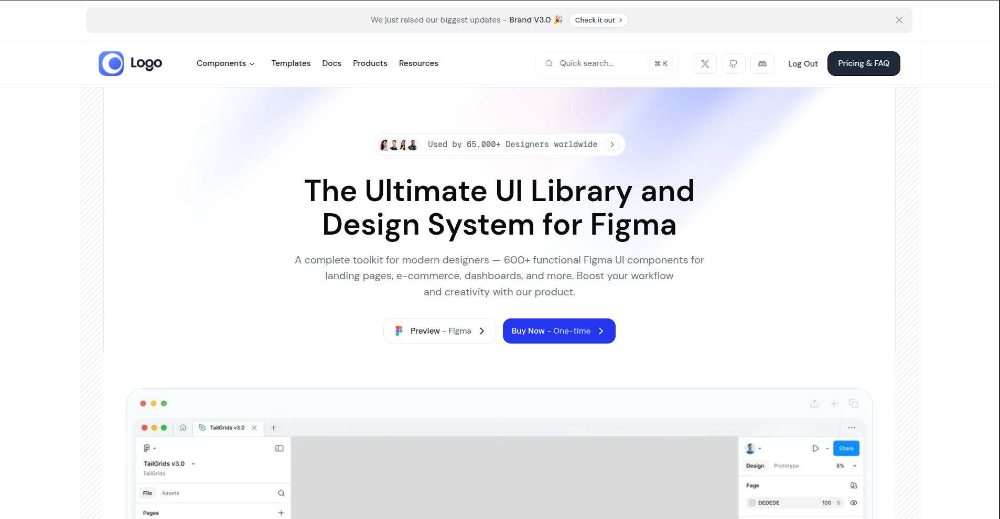

# Frontend Developer Assignment

## Table of Contents

- [Project Overview](#-project-overview)
- [Assignment Requirements](#-assignment-requirements)
  - [1. Landing Page](#1-landing-page)
  - [2. Authentication Pages](#2-authentication-pages)
  - [3. Dashboard Page](#3-dashboard-page)
- [Key Features Implemented](#-key-features-implemented)
- [Additional Features](#-additional-features)
- [Demo](#-demo)
- [Design Decisions](#-design-decisions)
  - [Architecture](#architecture)
  - [Component Composition](#component-composition)
- [Project Structure](#-project-structure)
- [Technologies Used](#-technologies-used)
- [Code Quality](#-code-quality)
- [Installation & Setup](#-installation--setup)
  - [Installation Steps](#installation-steps)
- [Author](#-author)
- [License](#-license)

---

## 📋 Project Overview

This project was developed as part of the technical assessment for the Frontend Web Developer position at Pimjo. The assignment demonstrates proficiency in modern and responsive web design, development best practices, and clean code architecture.

## 🎯 Assignment Requirements

### 1. **Landing Page**

- Implement the landing page **exactly as per Figma** (pixel-perfect).
- Ensure the layout is fully **responsive** and visually consistent.
- Include all animations, hover states, and transitions from the design.
- **Header navigation menu** — dynamically fetched from:
  `GET https://69102d7545e65ab24ac5d435.mockapi.io/mega-menu`

---

### 2. **Authentication Pages**

- Build both **Sign In** and **Sign Up** pages based on the design.
- Implement **authentication logic** using **Next.js 16 best practices**:
  - Use the **App Router**.
  - Secure pages with **middleware**.
  - Manage sessions or tokens efficiently (`NextAuth` or custom logic.)
- Include form validation, error states, and redirect logic after login/signup.

### 3. **Dashboard Page**

- After login, users should be redirected to the **Dashboard**.
- The dashboard must include:
  - **Users table** — fetched from:
    `GET https://69102d7545e65ab24ac5d435.mockapi.io/users`
  - Display **5 users per page** with **client-side pagination**.
  - Implement **client-side search** (optional: filter by name or email).
  - Enable **delete user** functionality via:
    `DELETE https://69102d7545e65ab24ac5d435.mockapi.io/users/:id`
- Add proper loading states, empty states, and error handling.

## 📊 Key Features Implemented

- **End‑to‑end authentication flow** with sign up, sign in, protected routes, and session management using Auth.js, Supabase Authentication, and Next.js Server Actions
- **Role‑ready dashboard experience** including post‑login redirect, secured access, and a layout designed for future expansion of analytics modules
- **Users management table** powered by MockAPI, supporting pagination, search/filtering, and delete operations with proper loading, empty, and error states
- **Pixel‑perfect, responsive UI** closely matching the Figma design across breakpoints, built with Tailwind CSS and modern interaction patterns (hover, focus, and transition states)
- **API‑driven navigation and content**, including a dynamic mega‑menu fetched from the provided mock API endpoint

## 🌟 Additional Features

Beyond the core requirements, I implemented:

- **Design refinements and micro‑adjustments** to align spacing, typography, and layout (e.g. fine‑tuning 1–2px gaps and padding) with the Figma design
- **Multiple authentication strategies**, supporting both credential‑based login and OAuth providers (GitHub and Google) on top of Auth.js and Supabase
- **Fuzzy search across key fields** (Deal ID, Customer, Email, Product) using a custom filter with `@tanstack/react-table` and debounced input for better UX
- **Enhanced table experience** with rich pagination (page ranges with ellipsis), item count display, row selection, and clear empty state messaging
- **API‑driven mega‑menu navigation**, fetched from the provided MockAPI endpoint with caching and on demand revalidation and graceful error handling using alerts/toasts

## 🌐 Demo

A live demo of the project can be found here: [https://pimjo-eta.vercel.app/](https://pimjo-eta.vercel.app/)

## 🎨 Design Decisions

### Architecture

- Used route group for scalability
- Implemented route-group based folder structure for `/components`
- Implemented shared components in a route group

### Component Composition

- Homepage: Homepage component composition can be found [here](./docs/component-compositions/home.readme.md).
- Dashboard: Dashboard component composition can be found [here](./docs/component-compositions/dashboard.readme.md).

## 🏗️ Project Structure

```
project-root/
├── public/               # Static assets (category-based: icons, products, mockups, etc.)
├── src/
│   ├── app/              # Next.js app router (routes, layout, global styles)
│   ├── components/       # Reusable UI and feature
│   │   ├── ui/       # Shadcn/ui components
│   │   ├── route-group-based-folder/       # Route-group based components
│   │   │   ├── shared/       # Shared components in a route group
│   ├── hooks/            # Custom React hooks
│   ├── lib/              # Library utils (auth, helpers, etc.)
│   ├── types/            # TypeScript types
│   ├── auth.ts           # Auth.js configuration
│   ├── next-auth.d.ts    # Next-Auth type definitions
│   └── proxy.ts          # Proxy configuration / helpers
├── .env.local            # Local environment variables (not committed)
├── components.json       # shadcn/ui configuration
├── next.config.ts        # Next.js configuration
├── package.json          # Project dependencies and scripts
├── pnpm-lock.yaml        # Lockfile for pnpm
├── tsconfig.json         # TypeScript configuration
└── README.md             # Project documentation
```

## 🚀 Technologies Used

- **Frontend Framework:** Next JS 16, React 19.2
- **Styling:** CSS3, Tailwind CSS
- **API Integration:** Fetch API
- **Other Libraries:** Auth.js, Supabase, Shadcn, Sonner

## 🔍 Code Quality

- **ESLint:** Configured for code linting
- **Prettier:** Configured for code formatting
- **Prettier Plugin Tailwind:** Configured for tailwind class sorting in a consistent order

## 📦 Installation & Setup

### Installation Steps

1. Clone the repository

```bash
git clone https://github.com/MohammadNaiem65/pimjo-task-one
cd pimjo-task-one
```

2. Install dependencies

```bash
pnpm install
```

3. Set up environment variables (Create a `.env.local` file)

```bash
# Supabase Configuration Keys
NEXT_PUBLIC_SUPABASE_URL=""
SUPABASE_ANON_KEY=""
SUPABASE_SERVICE_ROLE_KEY=""

# OAuth Configuration Keys
GITHUB_CLIENT_ID=""
GITHUB_CLIENT_SECRET=""
GOOGLE_CLIENT_ID=""
GOOGLE_CLIENT_SECRET=""

# Auth.js Configuration Keys
AUTH_SECRET=""
AUTH_TRUST_HOST=true
```

Edit `.env.local` file with your configuration settings.

4. Start the development server

```bash
pnpm run dev
```

5. Open your browser and navigate to `http://localhost:3000` (or specified port)

## 👤 Author

**Md Rifat Ahmed Tusar**

- Email: [ahmedrtusar71@gmail.com](mailto:ahmedrtusar71@gmail.com)
- LinkedIn: [https://www.linkedin.com/in/rifat-ahmed-tusar](https://www.linkedin.com/in/rifat-ahmed-tusar)
- Portfolio: [https://ahmedrtusar.web.app/](https://ahmedrtusar.web.app/)
- GitHub: [https://github.com/MohammadNaiem65](https://github.com/MohammadNaiem65)

## 📄 License

This project was created for assessment purposes for Pimjo.
